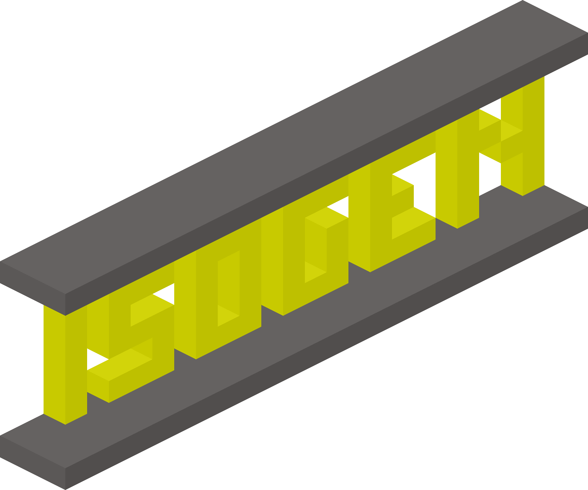

# isogen

Generate isometric images from ingame builds



# Api

## `isogen.draw(pos1, pos2, rotation?, cube_len?)`

Renders an isometric image and returns the png data

Example:
```lua
local pos1 = vector.new(0,0,0)
local pos2 = vector.new(16,16,16)
local rotation = 0
local cube_len = 24 -- multiple of 4 and greater than 4 pixels

-- render and save to world-directory
local png = isogen.draw(pos1, pos2, rotation, cube_len)
local path = minetest.get_worldpath() .. "/iso.png"
minetest.safe_file_write(path, png)
```

## `isogen.create_canvas(width, height)`

Creates a canvas to set and get pixels

Example:
```lua
-- create a canvas, draw a pixel on the coords 0,0 and save the png to the world-directory
local c = isogen.create_canvas(240, 160)
c:set_pixel(0, 0, { r=255, g=0, b=0, a=0 })

local png = c:png()
local path = minetest.get_worldpath() .. "/iso.png"
minetest.safe_file_write(path, png)
```

# License

* Code: `MIT`